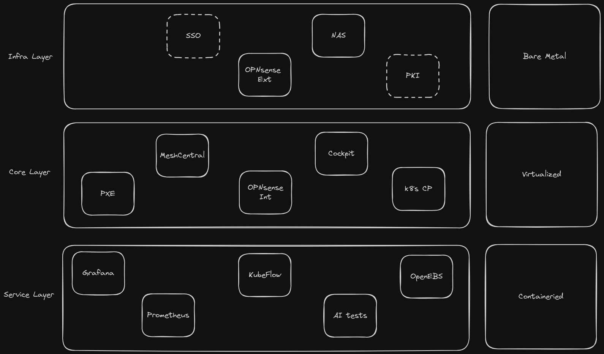

# TODO

- Secure Grafana and Prometheus (TLS + passwords)
- Add persistence for grafana and prometheus
- Add PVC backups
- Add replicated storage (See [Replicated Storage Poc](docs/replicated-storage-poc.md))

## Architecture

## References

- https://docs.fedoraproject.org/en-US/fedora-coreos/
- https://docs.fedoraproject.org/en-US/fedora-coreos/provisioning-raspberry-pi4/
- https://coreos.github.io/butane/
- https://github.com/intel/intel-device-plugins-for-kubernetes/blob/main/cmd/gpu_plugin/README.md
- https://github.com/intel/intel-device-plugins-for-kubernetes/tree/main/cmd/gpu_plugin#testing-and-demos
- https://github.com/boliu83/ipxe-boot-server
