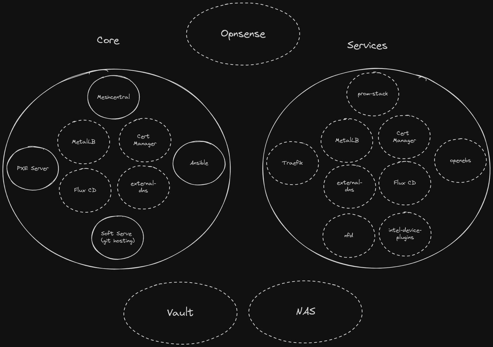

# TODO

- Add ansible role for hypervisors
- Add PVC backups
  - https://github.com/vmware-tanzu/helm-charts/tree/main/charts/velero
  - https://github.com/minio/minio
  - https://velero.io/docs/main/contributions/minio/
- Play around with WASM and SpinKube https://www.spinkube.dev/

## Parking Lot

- Add replicated storage (See [Replicated Storage Poc](docs/replicated-storage-poc.md))
  - Depends on control plane migration

## Architecture

## References

- https://docs.fedoraproject.org/en-US/fedora-coreos/
- https://docs.fedoraproject.org/en-US/fedora-coreos/provisioning-raspberry-pi4/
- https://coreos.github.io/butane/
- https://github.com/intel/intel-device-plugins-for-kubernetes/blob/main/cmd/gpu_plugin/README.md
- https://github.com/intel/intel-device-plugins-for-kubernetes/tree/main/cmd/gpu_plugin#testing-and-demos
- https://github.com/boliu83/ipxe-boot-server
- https://meshcentral.com/docs/MeshCentral2UserGuide.pdf
- https://bash-prompt.net/guides/ssh-certificates/
- https://docs.opnsense.org/development/api.html
- https://github.com/ProjectPhysX/OpenCL-Benchmark
